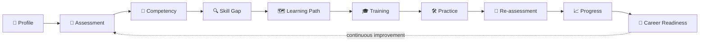
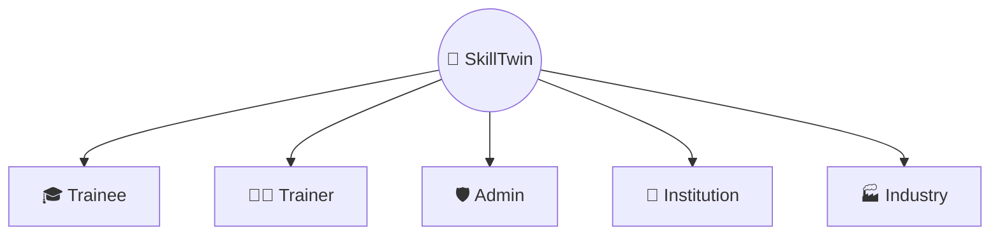
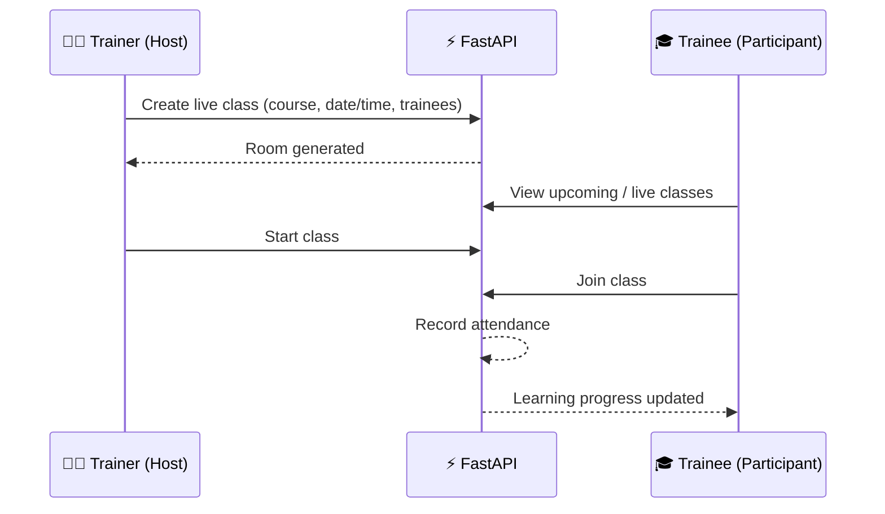
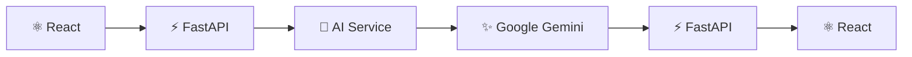
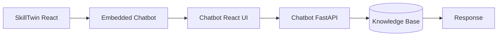
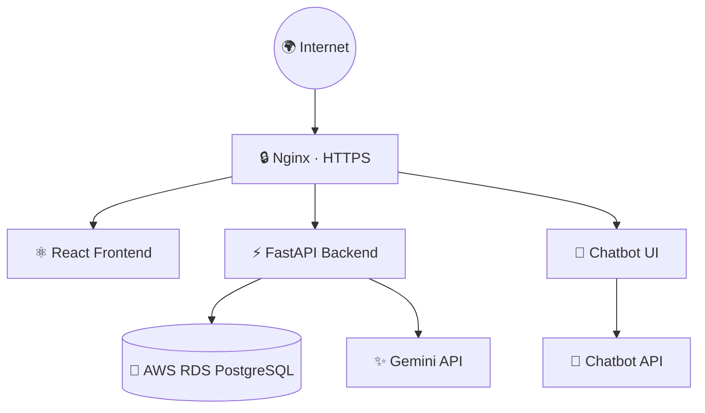
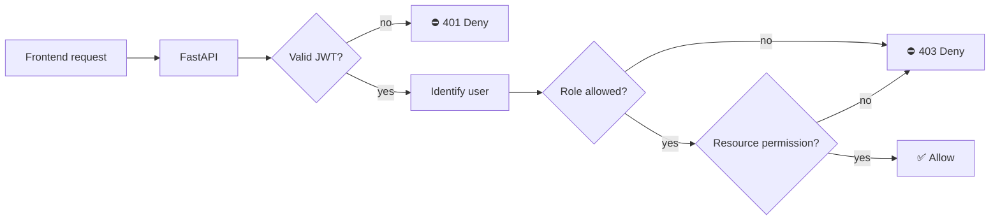

<div align="center">


<a href="https://skilltwin.duckdns.org">
  
</a>

<br/><br/>

[](https://skilltwin.duckdns.org)


</div>


SkillTwin is a full-stack **AI-powered competency intelligence, learning, training and capacity-building platform** that connects **learners, trainers, institutions, industries and administrators** in one ecosystem.

Unlike a traditional LMS that tracks courses and completion, SkillTwin focuses on:

> 🎯 **What a learner knows → what is missing → what to learn next → how competency changes over time.**

<div align="center">

| 📚 Learning | 🧠 Competency | 🔍 Skill Gap | 📝 Assessments | 🤖 AI Tools |
|:-:|:-:|:-:|:-:|:-:|
| Courses & Paths | Evidence-based | Priority gaps | MCQs & Questionnaires | Tutor · Interview · Resume |

| 🎥 Live Classes | 💬 Chatbot | 🏆 Certificates | 💼 Career Readiness | 📊 Analytics |
|:-:|:-:|:-:|:-:|:-:|
| Virtual classroom | Knowledge-base bot | Achievements | Opportunities | Role-based reports |

</div>


## 📌 Table of Contents

- [🌐 Live Application](#-live-application)
- [🧠 Overview](#-overview)
- [🎯 Problem Statement](#-problem-statement)
- [💡 Our Solution](#-our-solution)
- [🧭 Core Philosophy](#-core-philosophy)
- [✨ Key Features](#-key-features)
- [👥 Role-Based Ecosystem](#-role-based-ecosystem)
- [🎥 Live Classes](#-live-classes--virtual-classroom)
- [🤖 AI Features](#-ai-features)
- [🧠 Competency & Skill Gap](#-competency-intelligence--skill-gap-analysis)
- [💬 Chatbot](#-skilltwin-chatbot)
- [🏗️ Architecture](#️-platform-architecture)
- [⚙️ Tech Stack](#️-technology-stack)
- [🗂️ Project Structure](#️-project-structure)
- [🔐 Security](#-authentication--security)
- [📸 Screenshots](#-screenshots)
- [💻 Local Development](#-local-development)
- [☁️ Production Deployment](#️-production-deployment)
- [🚨 Gemini 503 Handling](#-gemini-api-503-error)
- [💼 Business Model](#-business-model)
- [🛣️ Roadmap](#️-roadmap)
- [🤝 Contributing](#-contributing)


## 🌐 Live Application

<div align="center">

### 🚀 **[https://skilltwin.duckdns.org](https://skilltwin.duckdns.org)**

</div>

Deployed on **AWS EC2 · AWS RDS PostgreSQL · Ubuntu · Nginx · HTTPS/SSL · FastAPI · React + Vite · Google Gemini · Systemd · DuckDNS**

---

## 🧠 Overview

> 💡 **Training completion does not necessarily mean competency.**

A learner may finish a course and still have major practical gaps. SkillTwin builds a continuous competency lifecycle:



<details>
<summary>Plain-text version</summary>

```text
PROFILE → ASSESSMENT → COMPETENCY → SKILL GAP → LEARNING PATH
   → TRAINING → PRACTICE → RE-ASSESSMENT → PROGRESS
   → CAREER READINESS → CONTINUOUS IMPROVEMENT
```

</details>

---

## 🎯 Problem Statement

| | Challenge |
|:-:|-----------|
| 🧩 | Training data is scattered across multiple systems |
| ✅ | Course completion is treated as the main indicator of learning |
| 🔎 | Skill gaps are hard to identify accurately |
| 🧭 | Learners don't know what to learn next |
| 👀 | Trainers lack central visibility into learner progress |
| 🏛️ | Institutions need consolidated competency analytics |
| 🏭 | Industry lacks visibility into workforce capability |
| 📜 | Certificates alone don't prove practical competency |
| 💼 | Career preparation is separated from learning |
| 🤖 | AI tools are disconnected from the learning workflow |
| 🎥 | Live training, assessments and progress are stored separately |

---

## 💡 Our Solution

**Traditional LMS**
```text
Course → Completion → Certificate
```

**SkillTwin**
```text
Profile → Assessment → Competency → Skill Gap → Learning Path
→ Training → Assessment → Progress → Career Readiness → Continuous Improvement
```

The question shifts from *"What did the learner complete?"* to ***"What can the learner actually do, what is missing, and what should happen next?"***

---

## 🧭 Core Philosophy

| # | Principle | Meaning |
|---|-----------|---------|
| 1️⃣ | **Evidence over assumptions** | Competency backed by measurable evidence |
| 2️⃣ | **Competency over completion** | Capability is the larger objective |
| 3️⃣ | **Personalized learning** | Recommendations respond to identified gaps |
| 4️⃣ | **Continuous measurement** | Competency evolves with new evidence |
| 5️⃣ | **Actionable intelligence** | Help users decide what to do next |

---

## ✨ Key Features

- 🔐 Secure authentication & role-based access control
- 👤 Trainee, trainer, institution, industry & admin management
- 📚 Course management & personalized learning paths
- 📝 Assessments: subject-wise MCQs, questionnaires, deadlines
- 🧠 Competency framework & skill management
- 🔍 Skill-gap analysis & progress tracking
- 🏆 Certificates, certifications & achievements
- 💼 Opportunities & career readiness
- 🔔 Notifications & announcements
- 📊 Analytics & reports
- 🤝 Trainer matching & trainer requests
- 🤖 AI Tutor · AI Interview · AI Resume
- 💬 Integrated chatbot
- 🎥 Live classes / virtual classroom

---

## 👥 Role-Based Ecosystem



<details open>
<summary><b>🎓 Trainee Portal</b></summary>

<br/>

- 📊 Dashboard: progress, courses, paths, competencies, skill gaps, assessments, certificates, achievements, opportunities, notifications
- 👤 Professional profile: qualifications, education, experience, skills, interests, certificates
- 📚 Browse, enroll, track and continue courses
- 🗺️ Learning paths based on competency requirements
- 📝 Attempt subject-wise MCQs and track assessment performance
- 🔍 Skill-gap analysis with recommended learning
- 💬 Submit course/content feedback
- 🏆 Certificates, achievements, opportunities & career readiness
- 🤖 AI Tutor · AI Interview · AI Resume

```text
Cloud Engineer Learning Path
Linux → Networking → AWS → Docker → Kubernetes → Cloud Security
```

</details>

<details>
<summary><b>👨‍🏫 Trainer Portal</b></summary>

<br/>

- 📊 Dashboard: trainees, courses, assessments, competencies, pending activities
- 👤 Profile: expertise, experience, skills, training information
- 🎓 Trainees: monitor assigned learners
- 📚 Courses: create and manage training content
- 🧠 Competencies: work with learner development data
- 📝 Questionnaires: create assessments & configure deadlines
- 📁 Library: recorded lectures, presentations, study materials
- 📨 Requests & 🔔 Notifications

</details>

<details>
<summary><b>🏫 Institution Portal</b></summary>

<br/>

Dashboard · learner & trainer management · courses · competencies · assessments · certifications · analytics · reports · training management. Built for colleges, universities and training institutions.

</details>

<details>
<summary><b>🏭 Industry Portal</b></summary>

<br/>

Skill requirements · workforce capability · talent discovery · competency visibility · training alignment · opportunities · analytics.

```text
Learning → Competency → Industry Requirements → Career Opportunities
```

</details>

<details>
<summary><b>🛡️ Admin Portal</b></summary>

<br/>

| Area | Modules |
|------|---------|
| 👥 **Users** | Trainees, Trainers, Institutions, Industries, Trainer Requests |
| 📚 **Learning** | Courses, Assessments, Certifications |
| 🧠 **Competency** | Competencies, Trainer Matching |
| 📣 **Communication** | Announcements, Notifications, Achievements |
| 📊 **Insights** | Analytics, Reports |
| ⚙️ **System** | Settings |

</details>

---

## 🎥 Live Classes & Virtual Classroom

SkillTwin is being extended with its own virtual classroom so live training becomes native to the competency ecosystem.



| Role | Permission |
|------|------------|
| 👨‍🏫 Trainer | **Host / Moderator** |
| 🎓 Trainee | **Participant** |

> 🔒 Permissions are determined by the **backend** using authenticated identity and class ownership/enrollment, never frontend parameters.

**Long-term loop:** `Live Class → Attendance → Participation → Assessment → Progress → Competency → Skill Gap → Recommendation`

---

## 🤖 AI Features

SkillTwin uses the **Google Gemini API** through a backend AI service layer.

| Feature | Description |
|---------|-------------|
| 🧑‍🏫 **AI Tutor** | Interactive learning assistance and explanations |
| 🎤 **AI Interview** | AI-driven interview preparation |
| 📄 **AI Resume** | Resume content assistance and improvement |
| 🧠 **AI Competency Intelligence** | Analysis of learner information where implemented |



🔑 The Gemini API key lives in `backend/.env` and is **never** exposed in frontend JavaScript.

---

## 🧠 Competency Intelligence & Skill Gap Analysis

```text
Competency: Cloud Computing
├── Linux
├── Networking
├── AWS
├── Docker
├── Kubernetes
└── Security
```

Evidence sources: assessments, courses, learning progress, trainer evaluation, certificates, practical activities.

```text
Target Role: Cloud Engineer

Linux        91%  🟢 Strong
AWS          86%  🟢 Strong
Docker       72%  🟡 Developing
Kubernetes   48%  🔴 Priority Gap
```

> ℹ️ Values above are illustrative example data.

```text
Skill Gap → Kubernetes → Fundamentals → Pods & Deployments → Services
→ Networking → Practical Assessment → Reassessment
```

---

## 💬 SkillTwin Chatbot

A dedicated chatbot backed by a structured knowledge base, intentionally separate from the Gemini AI service.



Production routes: `/chatbot/` · `/chatbot/api/` · `/embed.js`

---

## 🏗️ Platform Architecture



<details>
<summary>Plain-text version</summary>

```text
                         INTERNET
                            │
                   ┌────────▼────────┐
                   │  NGINX (HTTPS)  │
                   └────────┬────────┘
          ┌─────────────────┼──────────────────┐
          ▼                 ▼                  ▼
    React Frontend     FastAPI Backend     Chatbot UI
                            │                  │
                    ┌───────┴───────┐          ▼
                    ▼               ▼      Chatbot API
          AWS RDS PostgreSQL    Gemini API
```

</details>

---

## ⚙️ Technology Stack

| Layer | Technologies |
|-------|--------------|
| 🎨 **Frontend** | React · Vite · JavaScript (JSX) · Tailwind CSS · React Router · Axios · Lucide React |
| ⚡ **Backend** | Python · FastAPI · Uvicorn · SQLAlchemy · Pydantic · JWT · REST APIs |
| 🗄️ **Database** | PostgreSQL · AWS RDS · psycopg2 |
| 🤖 **AI** | Google Gemini API · Google GenAI Python SDK |
| ☁️ **Infra** | AWS EC2 · AWS RDS · Ubuntu · Nginx · Systemd · HTTPS/SSL · DuckDNS · Docker |
| 🧰 **Dev** | Git · GitHub · npm · Python venv · PowerShell · Linux shell |

---

## 🗂️ Project Structure

```text
SkillTwin/
├── backend/
│   ├── app/
│   │   ├── ai/  core/  models/  routers/  schemas/  services/
│   │   └── main.py
│   ├── catalog/  migrations/  scripts/  uploads/
│   ├── requirements.txt
│   └── .env
├── frontend/
│   ├── public/
│   ├── src/
│   │   ├── assets/  components/  context/  hooks/  pages/  services/
│   │   └── App.jsx
│   ├── package.json
│   └── vite.config.js
├── chatbot/
│   ├── backend/   (app/engine, knowledge, routers, main.py)
│   ├── frontend/
│   └── embed/embed.js
├── screenshots/
├── db_schema.sql · skilltwin.sql · skilltwin_backup.sql
└── README.md
```

---

## 🔐 Authentication & Security

- 🔑 Password hashing & JWT authentication
- 🛂 Role-based access control & protected routes
- 🧱 Backend authorization on every sensitive action
- 🌍 CORS configuration, HTTPS, Nginx reverse proxy
- 🗝️ Environment variables, private DB credentials, backend-only AI keys
- ✅ Active/inactive account handling & separate admin flow



---

## 📸 Screenshots

<div align="center">

### 🏠 Platform Overview


<br><br>

---

### 🔐 Authentication

<table>
<tr>
<td align="center" width="50%">

<b>Login</b><br><br>


</td>

<td align="center" width="50%">

<b>Registration</b><br><br>


</td>
</tr>
</table>

<br>

---

## 🎓 Trainee Experience

### 📊 Trainee Dashboard


<br><br>

### 📚 Learning & Courses

<table>
<tr>
<td align="center" width="50%">

<b>Explore Courses</b><br><br>


</td>

<td align="center" width="50%">

<b>My Courses</b><br><br>


</td>
</tr>
</table>

<br>

### 🧠 Competency & Assessments

<table>
<tr>
<td align="center" width="50%">

<b>Competency</b><br><br>


</td>

<td align="center" width="50%">

<b>Assessments</b><br><br>


</td>
</tr>
</table>

<br>

### 💼 Opportunities & Profile

<table>
<tr>
<td align="center" width="50%">

<b>Opportunities</b><br><br>


</td>

<td align="center" width="50%">

<b>Trainee Profile</b><br><br>


</td>
</tr>
</table>

<br>

---

## 👨‍🏫 Trainer Experience

### 📊 Trainer Dashboard


<br><br>

### 📚 Trainer Library


<br><br>

### ❓ Trainer Questions


<br><br>

### 🎥 Trainer Live Learning

<table>
<tr>

<td align="center" width="33%">

<b>Join Live Session</b><br><br>


</td>

<td align="center" width="33%">

<b>Ready Screen</b><br><br>


</td>

<td align="center" width="33%">

<b>Live Class</b><br><br>


</td>

</tr>
</table>

<br>

---

## 🏫 Institution Experience

### 📊 Institution Dashboard


<br><br>

### 👨‍🎓 Learner Management


<br><br>

### 📚 Programs


<br><br>

### 👨‍🏫 Trainer Management


<br>

---

## 🏭 Industry Experience

### 📊 Industry Dashboard


<br><br>

### 🧠 Industry Competency


<br><br>

### 🎯 Industry Skills


<br>

---

## 🛡️ Administration

### 📊 Admin Dashboard


<br><br>

### 📚 Course Management


<br><br>

### 📝 Registration Requests


<br>

---

## 🤖 AI-Powered Features

<table>
<tr>

<td align="center" width="33%">

<b>AI Tutor</b><br><br>


</td>

<td align="center" width="33%">

<b>AI Interview</b><br><br>


</td>

<td align="center" width="33%">

<b>AI Resume</b><br><br>


</td>

</tr>
</table>

<br>

---

## 💬 AI Assistant


<br><br>

---

## 🎥 Trainee Live Learning

<table>
<tr>

<td align="center" width="33%">

<b>Join Live Session</b><br><br>


</td>

<td align="center" width="33%">

<b>Ready Screen</b><br><br>


</td>

<td align="center" width="33%">

<b>Live Class</b><br><br>


</td>

</tr>
</table>

<br>

</div>

---

## 📊 Analytics & Reporting

| Role | Insights |
|------|----------|
| 🎓 Trainee | Progress, competency, skill gaps, career readiness |
| 👨‍🏫 Trainer | Learner performance, participation, competency outcomes |
| 🏫 Institution | Learner & training analytics, competency matrix, certifications |
| 🏭 Industry | Skill requirements, workforce capability, talent visibility |
| 🛡️ Admin | Platform-wide users, courses, assessments, competencies, reports |

---

## 💼 Business Model

**B2B / B2B2C SaaS** for universities, colleges, training institutions, government bodies, enterprises, corporate L&D, skill-development organizations and industry bodies.

- 💳 **SaaS subscription:** by learners, trainers, features, analytics, AI usage, storage
- 🏢 **Enterprise deployment:** custom branding, frameworks, workflows, integrations
- 🛒 **Training marketplace:** premium courses, trainer services, certifications
- 🤖 **AI usage:** premium/enterprise/usage-based plans

---

## 🛣️ Roadmap

**✅ Current Platform**
- [x] Role-based auth · Trainee / Trainer / Admin / Institution / Industry portals
- [x] Courses · Assessments · Competencies · Skill gap · Learning paths · Progress
- [x] Certificates · Achievements · Opportunities · Career readiness
- [x] AI Tutor · AI Interview · AI Resume · Chatbot
- [x] Analytics · Reports · AWS deployment · HTTPS · Production domain

**🚧 In Progress / Next**
- [ ] Fully integrated live classes & attendance
- [ ] Virtual classroom analytics
- [ ] Advanced competency evidence & automated updates
- [ ] Improved learning recommendations
- [ ] Industry skill-demand mapping & advanced trainer matching
- [ ] More advanced AI evaluation & production AI fallback handling

**🔮 Future**
- [ ] Multi-tenant SaaS & organization-specific frameworks
- [ ] Workforce intelligence & skill-demand forecasting
- [ ] Enterprise & LMS integrations
- [ ] Mobile application
- [ ] Advanced AI agents & automated learning interventions

---

## 🌟 SkillTwin

### Assess → Identify → Learn → Reassess → Improve

> **Capability, not assumptions.**

**React · Vite · Tailwind CSS · FastAPI · Python · SQLAlchemy · PostgreSQL · AWS · Nginx · Gemini API**

### 🚀 [Visit the Live Platform](https://skilltwin.duckdns.org)

**Built to Transform Learning Into Measurable Capability.**


</div>
